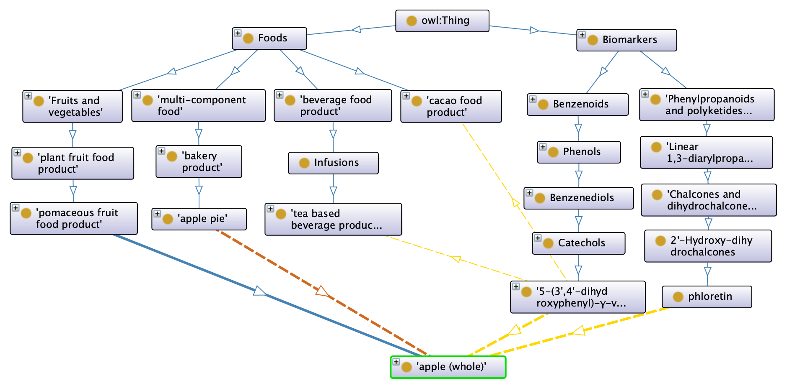
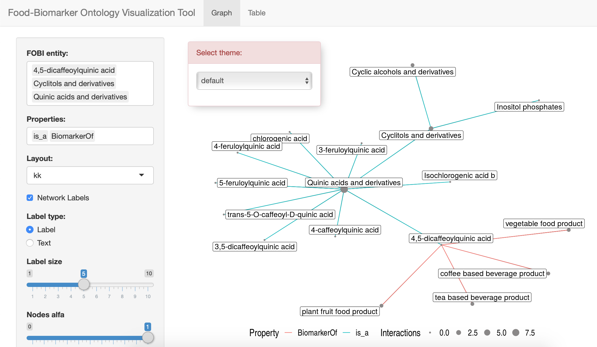
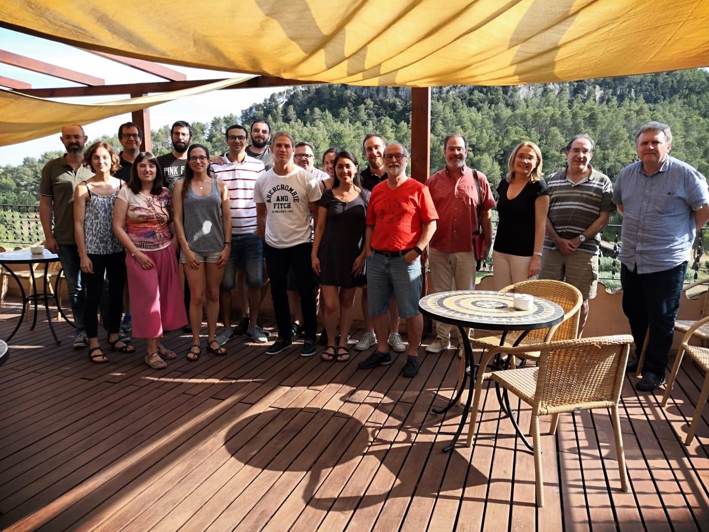

  
# Context and Aim
  
## Context
  
  - Heterogeneus nutritional data (FOODON...)
  - Difficult association of nutritional data with other types of data
  - **Non clear relationships between foods and metabolites**
  
## Aim
  
  - Create an ontology to describe the many complex relationships between diet derived metabolites and foods in a consistent and homogeneous way

---

# Results

## FOBI (Food-Biomarker Ontology)

  - 2 sub-ontologies
  - 1197 terms
  - 4 different properties
  - 13 food top-level classes
  - 11 biomarker top-level classes
  - More than 4700 logical axioms
  - Part of **OBOFoundry project** [http://purl.obolibrary.org/obo/fobi.owl](http://purl.obolibrary.org/obo/fobi.owl)
  - FOBI IDs already indexed into the [HMDB](https://hmdb.ca) (Human Metabolome Database) and [FooDB](https://foodb.ca) (Food Database)

<a href="https://github.com/pcastellanoescuder/FoodBiomarkerOntology"><i class="fab fa-github"></i>&nbsp; https://github.com/pcastellanoescuder/FoodBiomarkerOntology</a> 

---

# Sub-Ontologies

## Food sub-ontology

  - 13 food top-level classes (according to the related importance with metabolites)
  - Most part of the structure adopted from FooDB
  - Around 350 terms (306 adopted from FOODON)

## Biomarker sub-ontology

  - 11 biomarker top-level classes
  - Structure adopted from ChemFOnt (chemical functional ontology)
  - Around 850 terms (159 adopted from CHEBI)

## Properties

  - _BiomarkerOf_ and _HasBiomarker_ (between Food and Biomarker sub-ontologies)
  - _Contains_ and _HasIngredient_ (within Food sub-ontology, to relate simple and multi-component foods)
  
---
  
# FOBI Architecture
  
## "apple" example
  
.center[

]

---
  
# Applications
  
  (among many other applications...)

1) **fobitools** (beta version): R Package to use and interact with FOBI [(https://github.com/pcastellanoescuder/fobitools)](https://github.com/pcastellanoescuder/fobitools)

2) **FOBI Visualization tool**: [(https://polcastellano.shinyapps.io/FOBI_Visualization_Tool)](https://polcastellano.shinyapps.io/FOBI_Visualization_Tool)

.center[
  

    
]

---
  
# Acknowledgements
  
.center[
    

      
]

  - To the [Statistics and Bioinformatics Research Group](https://sites.google.com/view/estbioinfo/home) and [Biomarkers and Nutritional & Food Metabolomics Research Group](http://www.nutrimetabolomics.com/) from [University of Barcelona](https://www.ub.edu/web/ub/en/index.html?)

  - To **Damion Dooley** for his help on the integration of FOODON and CHEBI

---

class: inverse, center, middle

# Thank you all and absolutely **welcome to contribute!**

<html>

</html> 

<a href="mailto:polcaes@gmail.com"><i class="fas fa-envelope"></i>&nbsp; polcaes@gmail.com</a> 
<a href="https://pcastellanoescuder.github.io/"><i class="fas fa-link"></i>&nbsp; pcastellanoescuder.github.io/</a> 
<a href="http://twitter.com/polcastellano_"><i class="fab fa-twitter"></i>&nbsp; @polcastellano_</a> 
<a href="https://github.com/pcastellanoescuder"><i class="fab fa-github"></i>&nbsp; @pcastellanoescuder</a> 
<a href="https://www.ub.edu/web/ub/en/index.html?"><i class="fas fa-map-marker-alt"></i>&nbsp; University of Barcelona</a>

