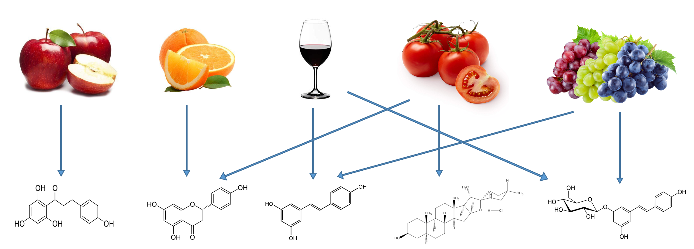
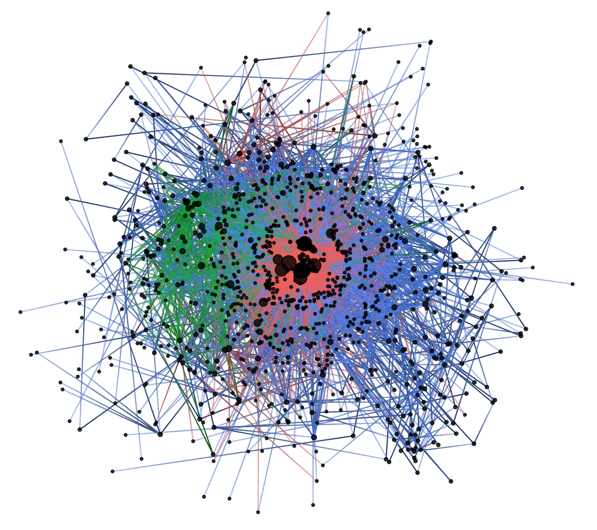
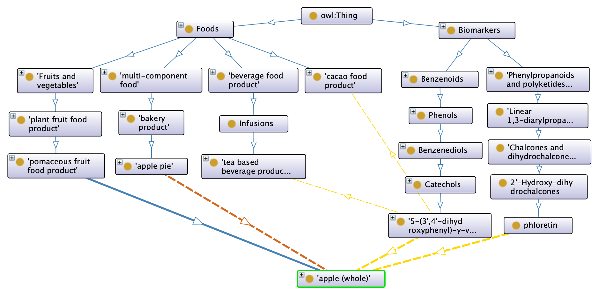
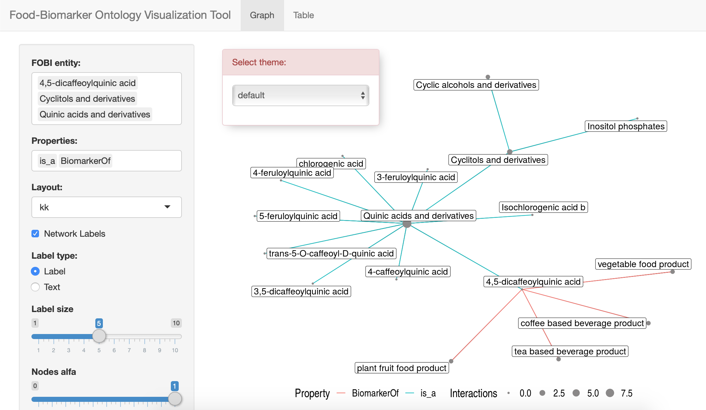
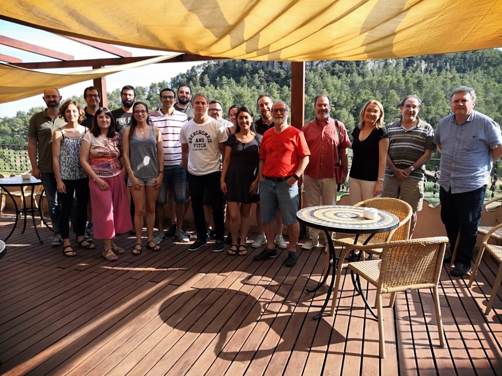

# Context

  .font130[
  - Heterogeneus nutritional data (<u>semantic problem</u>) -> **FoodOn**
  ]    

  .font130[
  - Difficult association of nutritional data with other types of data (<u>semantic and quantitative problem</u>)  
  ]

  .font130[
  - **Unclear relationships between foods and metabolites**     
  ]
  
.center[]

---

# Aims

  .font130[
  - Create an ontology that clearly defines the many complex relationships between **diet derived metabolites** and **foods** in a consistent and homogeneous way
  ]

  .font130[
  - Reuse previous existing terms to maintain a consistent and standardized nomenclature (OBOFoundry)
    - FoodOn 
    - ChEBI
  ]

.center2[]    

  .font130[
  - Propose a consistent starting point for nutrimetabolomic studies 
    - Design
    - Validation
  ]

---

# FOBI (Food-Biomarker Ontology)

<a href="https://github.com/pcastellanoescuder/FoodBiomarkerOntology"><i class="fab fa-github"></i>&nbsp; https://github.com/pcastellanoescuder/FoodBiomarkerOntology</a><br>

.pull-left[

## Metrics 

  - 2 sub-ontologies
  - 1197 terms
  - 4 different properties
  - 13 food top-level classes
  - 11 biomarker top-level classes
  - More than 4700 relationships
  - Part of **OBOFoundry project** [http://purl.obolibrary.org/obo/fobi.owl](http://purl.obolibrary.org/obo/fobi.owl)
  - FOBI IDs are indexed into the [HMDB](https://hmdb.ca) (Human Metabolome Database) and [FooDB](https://foodb.ca) (Food Database)
]

.pull-right[]      

---

# Sub-Ontologies

## Food sub-ontology

  - 13 food top-level classes (according to the related importance with metabolites)
  - Most part of the structure adopted from FooDB
  - Around 350 terms (306 adopted from FOODON) -> ~ 87%

## Biomarker sub-ontology

  - 11 biomarker top-level classes
  - Structure adopted from ChemFOnt (chemical functional ontology)
  - Around 850 terms (159 adopted from CHEBI) -> ~ 19%

## Properties

  - _BiomarkerOf_ and _HasBiomarker_ (between Food and Biomarker sub-ontologies)
  - _Contains_ and _IsIngredientOf_ (within Food sub-ontology, to relate raw and multi-component foods)
  
---
  
# FOBI Architecture
  
## FOODON:00002473 -> "apple (whole)"
  
.center[



]

---
  
# Applications

1) **fobitools** (beta version): R package that provides some FOBI applications like ORA or automatic nutritional text annotation. [https://github.com/pcastellanoescuder/fobitools](https://github.com/pcastellanoescuder/fobitools)

2) **FOBI Visualization Tool**: [https://polcastellano.shinyapps.io/FOBI_Visualization_Tool](https://polcastellano.shinyapps.io/FOBI_Visualization_Tool)

.center[]

---
  
# Thank you all!
  
.center[
    

      
]

```{r, echo = FALSE, eval = FALSE}
pagedown::chrome_print("FOBI_slides_IFOW2020_short.Rmd")
```

